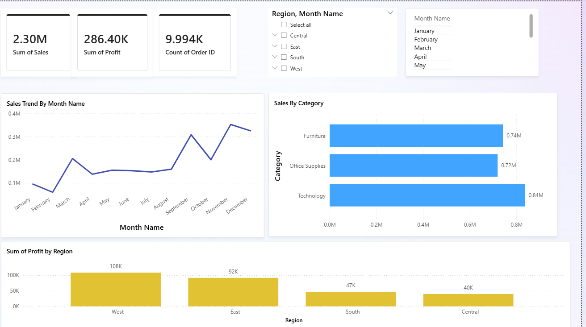

# Powerbi-Superstore-Dashboard
Interactive Power BI dashboard analyzing retail sales, profit, and regional performance.
## Objective
Analyze sales, profit, and regional performance trends using Power BI.

## Tools Used
- Power BI
- DAX
- Power Query

## KPIs
- Total Sales
- Total Profit
- Total Orders

## Key Insights
- Technology category generated highest sales.
- West region delivered highest profit.
- Sales increased during Q4 months.

## Business Recommendations
- Increase investment in high-performing categories.
- Improve strategies for lower-performing regions.
- Prepare inventory before seasonal demand spikes.

## Dashboard Preview

